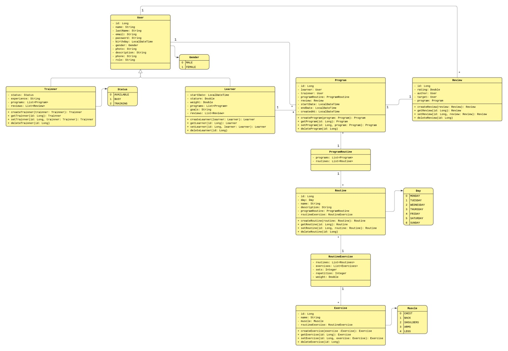

# 🏋️Fithub 💪  
**CS2031: Desarrollo Basado en Plataformas**

---

### 👥 Integrantes del grupo

- Quispe Monzón, Oswaldo Alejandro  
- Villegas Arce, Carlos Alberto  
- Ninamango Arroyo, Bryan Robert  
- Maguiña Quispe, Paul Ricardo  

---

# 📚 Índice

- [Introducción](#introduccion)
  - [Contexto](#contexto)
  - [Objetivos](#objetivos)
- [Identificación del problema](#identificacion-del-problema)
  - [Descripción del problema](#descripcion-del-problema)
  - [Justificación](#justificacion)
- [Descripción de la solución](#descripcion-de-la-solucion)
  - [Funcionalidades implementadas](#funcionalidades-implementadas)
  - [Tecnologías utilizadas](#tecnologias-utilizadas)
- [Modelo de entidades](#modelo-de-entidades)
- [Testing y manejo de errores](#testing-y-manejo-de-errores)
  - [Niveles de testing](#niveles-de-testing)
  - [Resultados](#resultados)
  - [Manejo de errores](#manejo-de-errores)
- [Medidas de seguridad implementadas](#medidas-de-seguridad-implementadas)
  - [Seguridad de datos](#seguridad-de-datos)
  - [Prevención de vulnerabilidades](#prevencion-de-vulnerabilidades)
- [Eventos y asincronía](#eventos-y-asincronia)
- [GitHub](#github)
  - [GitHub Actions](#github-actions)
- [Conclusión](#conclusion)
  - [Logros del proyecto](#logros-del-proyecto)
  - [Aprendizajes clave](#aprendizajes-clave)
  - [Trabajo futuro](#trabajo-futuro)
- [Apéndices](#apendices)
  - [Licencia](#licencia)
  - [Referencias](#referencias)

---

# 🚀 Introducción

## Contexto

Hoy en día, muchas personas asisten al gimnasio sin conocer la forma correcta de realizar los ejercicios, lo que puede causar lesiones o limitar los resultados. Además, no todos cuentan con acceso constante a un entrenador personal que los guíe. Este proyecto surge como una forma de apoyar a los usuarios en su entrenamiento, brindándoles una herramienta digital donde puedan aprender, seguir rutinas y mejorar su técnica mediante modelos 3D interactivos.

## Objetivos 🎯

- Permitir a los usuarios visualizar en 3D la ejecución correcta de cada ejercicio.  
- Gestionar rutinas personalizadas según objetivos individuales.  
- Promover el entrenamiento seguro y la prevención de lesiones.  
- Motivar la constancia y el progreso en la práctica deportiva.  

---

# ❓ Identificación del problema

## Descripción del problema

Muchas personas que entrenan en el gimnasio realizan los ejercicios sin conocer la técnica adecuada, lo que puede provocar lesiones, desmotivación o falta de resultados visibles. Además, no todos cuentan con el tiempo o los recursos para acceder a un entrenador personal que los guíe de forma constante. Esto genera una experiencia de entrenamiento poco efectiva y, en muchos casos, frustrante para quienes buscan mejorar su condición física.

## Justificación

Contar con una herramienta que oriente de manera visual y accesible a los usuarios puede marcar la diferencia en su progreso físico y bienestar general. A través de modelos 3D que muestran la ejecución correcta de los ejercicios, los usuarios pueden aprender de forma autónoma y segura, reduciendo el riesgo de lesiones y mejorando su rendimiento. Este proyecto busca así democratizar el acceso a la educación fitness, brindando apoyo tanto a principiantes como a deportistas experimentados que deseen perfeccionar su técnica.

---

# 🧩 Descripción de la solución

## ⚙️ Funcionalidades Implementadas

1. **Registro de usuarios:** Permite crear cuentas nuevas con datos personales, foto, descripción y rol asignado (entrenador o aprendiz).  
2. **Gestión de entrenadores:** Los entrenadores pueden registrar su experiencia, estado (disponible, ocupado o en entrenamiento) y administrar sus programas.  
3. **Gestión de aprendices:** Los aprendices pueden registrar su peso, estatura, fecha de inicio y vincularse con un entrenador.  
4. **Creación de programas de entrenamiento:** Los entrenadores pueden crear programas personalizados que agrupan diferentes rutinas según el objetivo del aprendiz.  
5. **Gestión de rutinas:** Cada rutina está asociada a un día específico y contiene los ejercicios, series, repeticiones y peso sugerido.  
6. **Gestión de ejercicios:** Registro y clasificación de ejercicios según el grupo muscular trabajado.  
7. **Sistema de reseñas:** Los aprendices pueden calificar y dejar opiniones sobre los programas o entrenadores.  

## 🛠️ Tecnologías utilizadas 

| Tecnología | Descripción |
|-------------|-------------|
| **Spring Boot** | Framework principal para el desarrollo del backend. |
| **Spring Data JPA** | Manejo de entidades y repositorios. |
| **PostgreSQL** | Base de datos relacional. |
| **Spring Security + JWT** | Autenticación y autorización segura. |
| **JUnit & Mockito** | Pruebas unitarias e integrales. |
| **Postman** | Testing y documentación de endpoints. |
| **GitHub** | Control de versiones y colaboración. |
| **Amazon Web Services (AWS)** | Plataforma de despliegue del backend. |

---

# 🧱 Modelo de Entidades

### Descripción de Entidades

#### **User**
Entidad principal que representa a todos los usuarios del sistema.  
Contiene información personal como nombre, apellido, correo, contraseña, fecha de nacimiento, foto y rol (entrenador o aprendiz).  

- **Atributos principales:** `id`, `name`, `lastname`, `email`, `password`, `birthday`, `gender`, `photo`, `role`.  
- **Relaciones:**  
  - Uno a uno con `Trainer` o `Learner` (según el rol del usuario).  
  - Uno a muchos con `Review` (como autor o receptor de reseñas).

---

#### **Trainer**
Representa a los entrenadores registrados en la plataforma.  
Cada entrenador tiene un estado que indica su disponibilidad (`AVAILABLE`, `BUSY`, `TRAINING`), su experiencia, y la lista de programas que gestiona.

- **Atributos principales:** `status`, `experience`.  
- **Relaciones:**  
  - Uno a uno con `User`.  
  - Uno a muchos con `Program` (programas creados por el entrenador).  
  - Uno a muchos con `Review` (reseñas recibidas).

---

#### **Learner**
Entidad que representa a los aprendices o clientes del gimnasio.  
Registra su peso, altura, fecha de inicio y los programas que tiene asignados.

- **Atributos principales:** `startDate`, `weight`, `height`.  
- **Relaciones:**  
  - Uno a uno con `User`.  
  - Uno a muchos con `Program` (programas asignados al aprendiz).  
  - Uno a muchos con `Review` (reseñas realizadas por el aprendiz).

---

#### **Program**
Agrupa una serie de rutinas que conforman un plan de entrenamiento.  
Cada programa está asociado a un entrenador y un aprendiz, y tiene un periodo de inicio y fin.

- **Atributos principales:** `startDate`, `endDate`, `createdAt`.  
- **Relaciones:**  
  - Muchos a uno con `Trainer` y `Learner`.  
  - Uno a muchos con `ProgramRoutine`.  
  - Uno a muchos con `Review`.

---

#### **ProgramRoutine**
Es una entidad intermedia que asocia un `Program` con las `Routine` que lo componen.  
Permite la organización de rutinas dentro de cada programa de entrenamiento.

- **Relaciones:**  
  - Muchos a uno con `Program`.  
  - Uno a muchos con `Routine`.

---

#### **Routine**
Representa una rutina de ejercicios planificada para un día específico de la semana.  
Contiene un nombre, descripción, día asignado y la lista de ejercicios correspondientes.

- **Atributos principales:** `day`, `name`, `description`.  
- **Relaciones:**  
  - Muchos a uno con `ProgramRoutine`.  
  - Uno a muchos con `RoutineExercise`.

---

#### **RoutineExercise**
Define la relación entre una rutina y los ejercicios que la componen, indicando detalles de ejecución.  

- **Atributos principales:** `sets`, `repetitions`, `weight`.  
- **Relaciones:**  
  - Muchos a uno con `Routine`.  
  - Muchos a uno con `Exercise`.

---

#### **Exercise**
Almacena los diferentes ejercicios disponibles en la aplicación, junto con el grupo muscular que trabajan.  

- **Atributos principales:** `name`, `muscle`.  
- **Relaciones:**  
  - Uno a muchos con `RoutineExercise`.

---

#### **Review**
Permite a los usuarios dejar una valoración sobre los programas o entrenadores, fomentando la retroalimentación.  

- **Atributos principales:** `rating`, `author`, `program`.  
- **Relaciones:**  
  - Muchos a uno con `User` (autor de la reseña).  
  - Muchos a uno con `Program`.

---

#### **Enumeraciones (Enums)**
- **Gender:** Define el género del usuario (`MALE`, `FEMALE`).  
- **Status:** Estado actual del entrenador (`AVAILABLE`, `BUSY`, `TRAINING`).  
- **Day:** Días de la semana asociados a las rutinas (`MONDAY`, `TUESDAY`, ..., `SUNDAY`).  
- **Muscle:** Grupo muscular trabajado por cada ejercicio (`CHEST`, `BACK`, `ARMS`, `LEGS`).

# 🧪 Testing y Manejo de Errores

## Niveles de Testing

1. **Testing de Repositorios:**  
   Se realizaron pruebas con `@DataJpaTest` para verificar las operaciones CRUD en entidades como `User`, `Trainer`, `Program`, `Routine` y `Exercise`.  
   Esto permitió validar la persistencia de datos y las relaciones entre entidades.

2. **Testing de Servicios:**  
   Se aplicaron pruebas unitarias utilizando **Mockito**, simulando dependencias y comprobando la lógica de negocio en operaciones como la creación de programas, asignación de rutinas y manejo de roles.

3. **Testing de Controladores:**  
   A través de `@WebMvcTest` y `MockMvc`, se probaron los endpoints REST del sistema, verificando los **códigos de estado HTTP**, las respuestas esperadas y el comportamiento frente a datos inválidos.

4. **TestContainers (en integración):**  
   Se está implementando el uso de **TestContainers con PostgreSQL** para realizar pruebas de integración en entornos aislados, simulando un ambiente real de base de datos.

## Resultados

Durante el proceso de testing se identificaron varios comportamientos inesperados. Algunos de los problemas detectados fueron:
  
- El endpoint `PATCH /api/exercises/{id}/asset` no actualizaba el campo en la base de datos porque la URL del archivo no pasaba por el mapper antes de persistirse.  
- El método `DELETE /api/programs/{id}` eliminaba el programa sin verificar si aún tenía rutinas asociadas, generando referencias huérfanas en la base de datos.  
- En `POST /api/routines/{id}/exercise`, los ejercicios duplicados podían añadirse varias veces a la misma rutina por falta de validación en el servicio.   
- En `PUT /api/programs/{id}`, las rutinas previamente asignadas se sobrescribían en lugar de actualizarse de forma incremental.  
   
Todos estos fallos fueron detectados mediante pruebas unitarias y de integración, y posteriormente corregidos.  

## Manejo de Errores

Se definieron varias excepciones adaptadas a los posibles escenarios del sistema:

- `ResourceNotFoundException` → **404 Not Found**: cuando un recurso (usuario, rutina, programa, etc.) no existe.  
- `UserAlreadyExistException` → **409 Conflict**: cuando se intenta registrar un usuario ya existente.  
- `DuplicateResourceException` → **409 Conflict**: cuando un recurso duplicado se intenta crear en la base de datos.  
- `InvalidOperationException` → **400 Bad Request**: cuando una acción no es válida o no está permitida.  
- `ForbiddenException` → **403 Forbidden**: cuando el usuario no tiene permisos para acceder a un recurso.  
- `UnauthorizedException` → **401 Unauthorized**: cuando el usuario no está autenticado o su token JWT es inválido.  
- `BadRequestException` → **400 Bad Request**: para peticiones con datos incompletos o mal formateados.  
- `ConflictException` → **409 Conflict**: conflictos de estado en operaciones concurrentes o inválidas.

# 🔒 Medidas de Seguridad Implementadas

### Seguridad de Datos

- **Cifrado de contraseñas:**  
  Todas las contraseñas se almacenan en la base de datos utilizando el algoritmo **BCrypt**, asegurando que nunca se guarden en texto plano.

- **Validación de credenciales:**  
  Durante el inicio de sesión, las credenciales se verifican mediante el servicio de autenticación de Spring Security antes de generar el token JWT.

- **Protección de endpoints:**  
  Los endpoints sensibles requieren autenticación mediante token, asegurando que solo usuarios válidos puedan acceder a ellos.

- **Gestión de variables sensibles:**  
  Las claves secretas del JWT y otras configuraciones de seguridad se almacenan en variables de entorno, evitando su exposición en el código fuente.

### Prevención de Vulnerabilidades

Para fortalecer la seguridad del backend se aplicaron las siguientes medidas:

- **Prevención de Inyección SQL:**  
  Uso de Spring Data JPA y consultas parametrizadas, evitando concatenaciones manuales en queries.

- **Protección contra XSS y CSRF:**  
  Configuración del `SecurityFilterChain` con políticas CORS adecuadas y desactivación del CSRF en endpoints JWT (ya que no se manejan sesiones de formulario).

- **Validación de entradas:**  
  Todas las solicitudes son validadas mediante anotaciones (`@NotNull`, `@Size`, `@Email`, etc.) y manejo de excepciones personalizadas para datos inválidos.

- **Cabeceras seguras:**  
  Configuración de cabeceras HTTP para evitar exposición de información sensible del servidor.

# ⚙️ Eventos y Asincronía

###  Uso de Eventos

Se hace uso del mecanismo de **eventos de Spring** (`ApplicationEventPublisher`) para ejecutar procesos secundarios sin interrumpir el flujo principal del sistema.  
Esto permite una arquitectura más desacoplada, donde ciertos componentes pueden reaccionar ante acciones específicas sin depender directamente de otros.

Ejemplos de eventos implementados:

- **Registro de usuario:**  
  Cuando un nuevo usuario se registra, se publica un evento que puede activar acciones como el envío de un correo de bienvenida o la creación automática de su perfil asociado (entrenador o aprendiz).  

- **Creación de programa:**  
  Al crear un programa, se dispara un evento que permite notificar al aprendiz asignado o registrar la fecha de creación para el historial de actividades.

### Procesamiento Asíncrono

Para evitar sobrecargar el hilo principal de ejecución, se utilizan tareas marcadas con la anotación `@Async`.  
Esto permite que ciertas operaciones se ejecuten en segundo plano mientras el servidor sigue atendiendo otras solicitudes.

Ejemplos de uso:

- **Envío de correos electrónicos:**  
  Los correos de registro o notificación se envían de forma asíncrona, garantizando que el usuario no tenga que esperar a que la operación finalice.

- **Registro de logs o auditorías:**  
  Se registran eventos importantes del sistema (como inicios de sesión o creación de rutinas) sin afectar el rendimiento del flujo principal.

# 🐙 GitHub

El desarrollo del proyecto se gestionó completamente desde **GitHub**, donde se organizaron las tareas mediante *issues* asignados a cada integrante del equipo.  
Cada funcionalidad se trabajó en una rama independiente, lo que permitió avanzar en paralelo sin interferir con el trabajo de los demás.  
Una vez completadas, las ramas se integraron a la principal mediante **pull requests**, asegurando revisiones y control de calidad en cada fusión.

## GitHub Actions

El repositorio cuenta con un **workflow automatizado** de GitHub Actions que ejecuta pruebas, compila el proyecto y lo despliega de forma continua.  
Cada vez que se actualiza la rama principal, se ejecutan los pasos del pipeline para verificar la correcta construcción y funcionamiento del sistema antes del despliegue final.

# 🏁 Conclusión

### Logros del Proyecto  
✅ Aplicación funcional para gestión de rutinas.  
✅ Seguridad robusta con JWT.  
✅ Modelos 3D interactivos.  
✅ Eventos y asincronía optimizados.  

### Aprendizajes Clave  
📚 Dominio de Spring Boot y arquitectura modular.  
🔐 Seguridad, validaciones y manejo de errores.  
🤝 Colaboración efectiva con GitHub.  

### Trabajo Futuro  
* Mejorar la interfaz visual de los modelos 3D para mayor realismo.
* Integrar notificaciones y recordatorios automáticos para las rutinas.
* Desplegar una versión pública con integración de front-end completo.

---

# 📎 Apéndices

###  Licencia
Este proyecto se distribuye bajo la licencia **MIT**.

### Referencias
- [Spring Boot Documentation](https://spring.io/projects/spring-boot)  
- [PostgreSQL Documentation](https://www.postgresql.org/docs/)  
- [JWT Official Site](https://jwt.io/)  
- [GitHub Actions Documentation](https://docs.github.com/en/actions)  
- [Spring Security Reference](https://docs.spring.io/spring-security/reference/index.html)

---

✨ **Gracias por leer nuestro README 🙌** ✨  

*Desarrollado con esfuerzo, colaboración y muchas líneas de código* 💻

